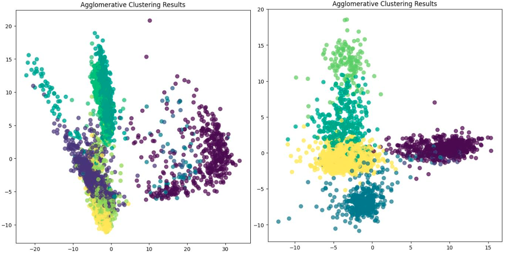
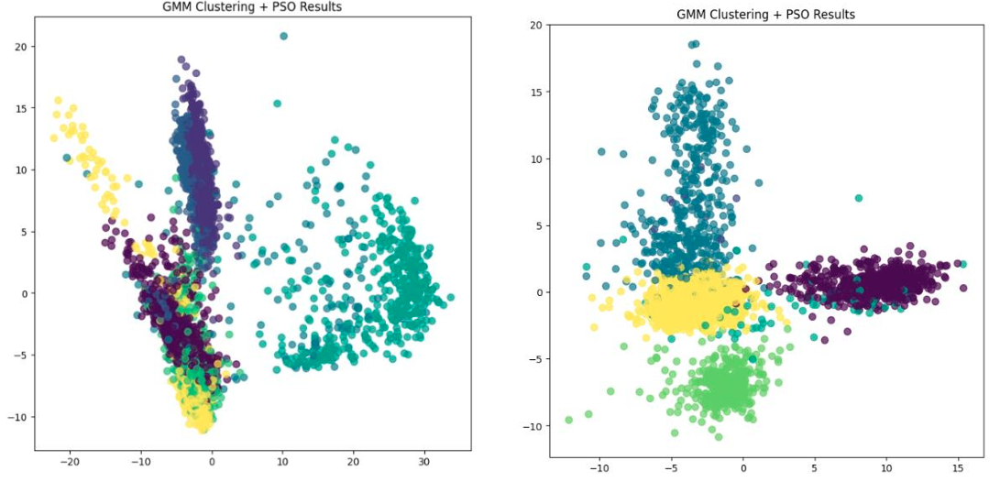
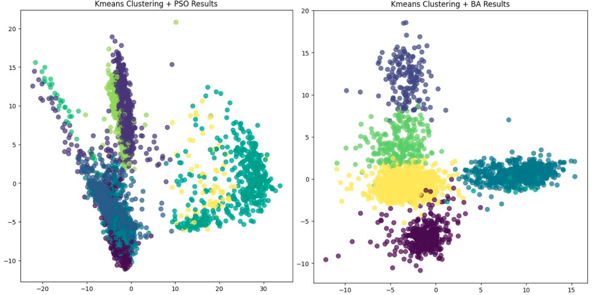

# Clustering scRNA-seq Data: A Comparative Analysis

🧬 This project tests different methods for clustering scRNA-seq data, including traditional algorithms (GMM, DBSCAN, KMeans, etc.) and swarm optimizers (PSO, GWO, ABC, FFA, BA). Performance is evaluated using Pbmc3k and NdpKO_R1 datasets with metrics like ARI, NMI, FMI, and execution time.

This project evaluates various clustering methods and swarm-based optimizers on scRNA-seq datasets to identify their effectiveness in handling high-dimensional biological data.

---

## Data Description 📊

The analysis uses two scRNA-seq datasets:
1. **Pbmc3k**: Peripheral blood mononuclear cells.
2. **NdpKO_R1**: Norrin-deficient (Ndp) knockout replicate 1.

### Preprocessing Steps
- **Filtering Genes/Cells**: Removed cells and genes based on predefined thresholds for expression levels.
- **Quality Control**: Eliminated cells with high mitochondrial gene expression (indicative of damage/stress).
- **Normalization**: Scaled data uniformly across cells.
- **Log Transformation**: Applied log transformation to reduce variability.
- **Feature Selection**: Identified highly variable genes.
- **Dimensionality Reduction**: Utilized PCA for feature space reduction.

---

## Methods 🛠️

### Clustering Algorithms
- **GMM**: Gaussian Mixture Model assumes each cluster follows a Gaussian distribution, optimized using Expectation-Maximization.
- **DBSCAN**: Groups dense regions of points and labels sparse regions as noise.
- **HDBSCAN**: Builds a hierarchy of clusters, improving DBSCAN's flexibility and noise handling.
- **KMeans**: Partitions data into `k` clusters by minimizing within-cluster variances.
- **Agglomerative Clustering**: A hierarchical method that merges clusters iteratively based on proximity.
- **Graph Neural Networks (GNN)**: Uses graph-based relationships between data points for dynamic clustering.

### Swarm-Based Optimizers
Integrated with GMM and KMeans for enhanced clustering:
- **PSO**: Models particles’ movement in search space to optimize cluster centers.
- **GWO**: Mimics wolf pack behavior to explore and exploit solutions.
- **ABC**: Simulates bees’ food search to optimize clustering.
- **FFA**: Inspired by fireflies’ flashing behavior to guide clustering.
- **BA**: Leverages bats’ echolocation for adaptive optimization.

---

## Results ✅

### Clustering Algorithms Performance on Pbmc3k Dataset
| Algorithm       | ARI   | NMI   | FMI   | Time (s) |
|------------------|-------|-------|-------|----------|
| HCDC            | 0.807 | 0.819 | 0.861 | 0.778    |
| Leiden          | 0.791 | 0.802 | 0.851 | 1.036    |
| Agglomerative   | 0.792 | 0.787 | 0.849 | 0.230    |
| Phenograph      | 0.753 | 0.796 | 0.816 | 1.356    |
| HDBSCAN         | 0.664 | 0.684 | 0.759 | 0.064    |
| DBSCAN          | 0.643 | 0.700 | 0.760 | 0.112    |
| GNN             | 0.625 | 0.596 | 0.744 | 346.000  |

### Swarm-Based Optimizers with GMM on Pbmc3k Dataset
| Optimizer        | ARI   | NMI   | FMI   | Time (s) |
|------------------|-------|-------|-------|----------|
| GMM + PSO       | 0.769 | 0.778 | 0.835 | 1180     |
| GMM + GWO       | 0.591 | 0.613 | 0.727 | 2492     |
| GMM + ABC       | 0.778 | 0.782 | 0.841 | 1854     |
| GMM + FFA       | 0.685 | 0.722 | 0.766 | 548      |
| GMM + BA        | 0.686 | 0.722 | 0.766 | 1125     |

### Clustering Algorithms Performance on NdpKO_R1 Dataset
| Algorithm       | ARI   | NMI   | FMI   | Time (s) |
|------------------|-------|-------|-------|----------|
| HCDC            | 0.942 | 0.910 | 0.953 | 5.082    |
| Leiden          | 0.926 | 0.904 | 0.941 | 1.287    |
| Agglomerative   | 0.932 | 0.910 | 0.946 | 0.738    |
| Phenograph      | 0.862 | 0.852 | 0.886 | 0.454    |
| HDBSCAN         | 0.698 | 0.756 | 0.751 | 0.917    |
| DBSCAN          | 0.698 | 0.756 | 0.751 | 0.672    |
| GNN             | 0.510 | 0.739 | 0.614 | 2.516    |

---

## Visualizations 📈
Detailed UMAP-reduced plots are provided in the report, showcasing cluster formations for each algorithm.

---

## Jupyter Notebook 📓

Explore the complete analysis, code, and visualizations in the [Jupyter Notebook](#). 
